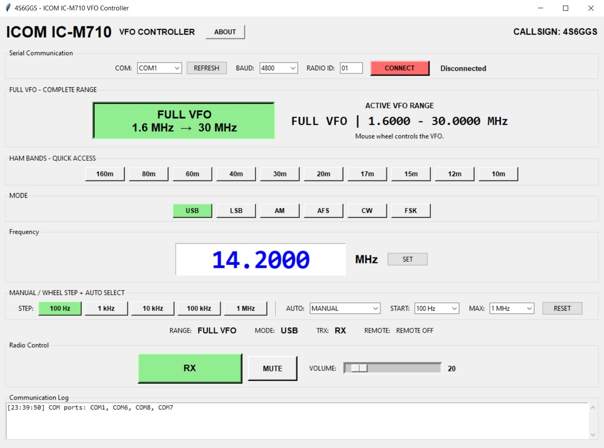

# ICOM IC-M710 VFO Controller

### Windows VFO & CI-V Remote Control Software for the ICOM IC-M710

**Current Release: v1.0.7**
**Developer: 4S6GGS**

A dedicated Windows application for controlling the **ICOM IC-M710 HF marine transceiver** through its serial/CI-V remote-control interface.

The controller provides computer-based frequency tuning, operating-mode selection, RIT control, radio-status monitoring, S-Meter display, audio controls, and serial communication monitoring.

---

## 📻 Application


### Key Capabilities

* Full VFO control from **1.6000–30.0000 MHz**
* Direct frequency entry
* Frequency readback
* Amateur-band quick selection
* USB, LSB, AM, AFS, CW and FSK modes
* Mouse-wheel frequency tuning
* Manual tuning steps from **100 Hz to 1 MHz**
* Automatic tuning acceleration
* RIT control
* RX/TX status
* Remote status
* Real-time S-Meter
* Volume control
* Speaker mute
* COM-port configuration
* Serial communication monitor
* Configurable Radio ID and Controller ID

---

# 🚀 Latest Release — v1.0.7

## Download

**Portable Windows executable — no Python installation required.**

[**Download ICOM_M710_VFO_Controller_1.0.7.exe**](software/ICOM_M710_VFO_Controller_1.0.7.exe)

[**Open the v1.0.7 GitHub Release**](https://github.com/4s6ggs/icom-icm710-vfo/releases/tag/v1.0.7)

---

## What's New in v1.0.7

Version 1.0.7 introduces several improvements to the communication and control interface.

### COM Port Setup

A dedicated **COM Port Setup** page has been added.

Configuration includes:

* COM Port
* Baud Rate
* Controller ID
* Radio ID

This separates communication configuration from the main VFO operating controls.

### COM Monitor

A **COM Monitor** has been added to the COM Port Setup page.

It provides visibility of serial communication between the computer and radio and can assist with diagnosing:

* Incorrect COM port
* Incorrect baud rate
* Radio ID problems
* Controller ID problems
* Missing radio responses
* Communication problems

### RIT Control

**RIT Control** is now available directly from the Main page.

This provides convenient receiver incremental tuning without changing the main VFO frequency.

### Communication Improvements

v1.0.7 also includes improvements to:

* COM-port configuration
* Serial communication monitoring
* Radio-control workflow
* General controller operation

---

## v1.0.7 File

```text
software/
└── ICOM_M710_VFO_Controller_1.0.7.exe
```

### SHA-256

```text
85e167451da74dc6a0ab8c68471e32b842706fe0b8516f771bec5275ed98b8b1
```

### Verify the Download

After downloading the executable, open PowerShell in the download directory and run:

```powershell
Get-FileHash .\ICOM_M710_VFO_Controller_1.0.7.exe -Algorithm SHA256
```

The result should be:

```text
85e167451da74dc6a0ab8c68471e32b842706fe0b8516f771bec5275ed98b8b1
```

---

# 📖 User Guide

A complete operating and setup guide is included in the repository.

**The guide is written for both experienced radio operators and users who are new to computer-controlled IC-M710 operation.**

[**Open the Complete User Guide →**](docs/USER_GUIDE.md)

The guide includes:

* IC-M710 setup
* Radio ID configuration
* COM-port configuration
* CI-V communication
* COM Monitor
* Frequency control
* Band selection
* Operating modes
* Mouse-wheel tuning
* Auto acceleration
* RIT
* RX/TX indication
* Remote status
* S-Meter
* Volume
* Speaker mute
* Troubleshooting
* DIY CP2102 interface
* DIY clone/remote-control cable construction
* SHA-256 verification

---

# ⚙️ Main Features

## Frequency Control

The controller provides a configurable full VFO range of:

**1.6000 MHz – 30.0000 MHz**

Features include:

* Direct frequency entry
* SET frequency control
* Frequency readback
* Full VFO operation
* Amateur-band quick selection
* Mouse-wheel tuning

---

## 🎛️ Mouse-Wheel Tuning

The mouse wheel can be used to tune the radio.

Available manual steps:

| Step | Resolution |
| ---- | ---------: |
| 1    |     100 Hz |
| 2    |      1 kHz |
| 3    |     10 kHz |
| 4    |    100 kHz |
| 5    |      1 MHz |

### Auto Acceleration

The controller can automatically increase the tuning step during continuous mouse-wheel operation.

The acceleration range can be configured using the starting and maximum tuning levels.

Maximum available step:

**1 MHz**

Press **ESC** to stop active wheel tuning.

---

# 📡 Amateur Band Selection

The controller provides quick access to commonly used HF amateur bands.

| Band  |  Controller Range | Default Frequency |
| ----- | ----------------: | ----------------: |
| 160 m |   1.800–2.000 MHz |         1.800 MHz |
| 80 m  |   3.500–4.000 MHz |         3.500 MHz |
| 60 m  |   5.250–5.450 MHz |         5.250 MHz |
| 40 m  |   7.000–7.300 MHz |         7.000 MHz |
| 30 m  | 10.100–10.150 MHz |        10.100 MHz |
| 20 m  | 14.000–14.350 MHz |        14.000 MHz |
| 17 m  | 18.068–18.168 MHz |        18.068 MHz |
| 15 m  | 21.000–21.450 MHz |        21.000 MHz |
| 12 m  | 24.890–24.990 MHz |        24.890 MHz |
| 10 m  | 28.000–29.700 MHz |        28.000 MHz |

> **Important:** These are controller quick-selection ranges. Users must comply with the applicable licensing conditions, band plans, and regulations in their jurisdiction.

---

# 🎚️ Operating Modes

The controller provides selection of:

* **USB** — Upper Sideband
* **LSB** — Lower Sideband
* **AM** — Amplitude Modulation
* **AFS**
* **CW** — Continuous Wave
* **FSK** — Frequency Shift Keying

The selected mode is sent to the IC-M710 through the configured serial interface.

---

# 📊 S-Meter

## Real-Time Signal Monitoring

Real-time S-Meter functionality was introduced in **v1.0.6**.

The display provides:

**S0 – S8**

While connected and receiving, the controller polls the radio approximately every **300 ms**.

### S-Meter Operation

* Signal level range: **S0–S8**
* Approximately 300 ms polling interval
* Uses IC-M710 `SIGM` / `ALY` response
* Polling stops during TX
* Returns to S0 when disconnected

The controller uses the following CI-V command:

```text
PICOA,90,<RADIO_ID>,SIGM,
```

---

# 📻 RIT Control

RIT Control was introduced in **v1.0.7**.

RIT allows receiver tuning to be adjusted independently from the main VFO frequency.

The RIT controls are located on the **Main page**.

---

# 🔌 CI-V Communication

The application communicates with the IC-M710 through its serial/CI-V remote-control interface.

## Default Configuration

| Parameter     | Default |
| ------------- | ------- |
| COM Port      | COM1    |
| Baud Rate     | 4800    |
| Controller ID | 90      |
| Radio ID      | 01      |

### Supported Baud Rates

```text
1200
2400
4800
9600
19200
```

---

# 🔢 Radio ID and Controller ID

The two IDs have different purposes.

```text
Controller ID = 90
Radio ID      = 01
```

The **Radio ID** identifies the IC-M710.

The **Controller ID** identifies the controlling device/application.

The controller's Radio ID should match the ID configured in the radio.

---

# 📻 Finding the IC-M710 Radio ID

The Radio ID can be checked through the IC-M710 setup mode.

### Procedure

1. Turn the IC-M710 **OFF**.
2. Press and hold **FUNC + 1**.
3. Turn the radio **ON**.
4. Enter the radio setup mode.
5. Use the **GROUP selector / left knob** to move through the setup items.
6. Locate the remote-control settings.
7. Look for:

```text
REMT -- ID 01
```

The number after `ID` is the Radio ID.

For example:

```text
REMT -- ID 01
```

means:

```text
Radio ID = 01
```

### Important

You may also see:

```text
REMT -- IF
```

This is the **remote-control interface selection**. It is not the Radio ID.

For complete setup information, see:

[**IC-M710 User Guide → Radio ID**](docs/USER_GUIDE.md)

---

# 🖥️ COM Port Setup

Version **1.0.7** introduces a dedicated COM Port Setup page.

The operator can configure:

* COM port
* Baud rate
* Controller ID
* Radio ID

The page also contains the COM Monitor.

This provides a central location for configuring and checking the computer-to-radio communication link.

---

# 🔍 COM Monitor

The COM Monitor allows the operator to observe serial communication.

It can help determine whether:

* Commands are being transmitted
* Radio responses are being received
* The selected COM port is correct
* The baud rate is correct
* The Radio ID is correct
* Communication is occurring normally

When troubleshooting communication, the COM Monitor should be one of the first places to check.

---

# 🔊 Audio Controls

The controller includes:

* **Volume**
* **Speaker Mute**

These provide basic audio control from the computer interface.

---

# ⚙️ Default Settings

| Setting       | Default            |
| ------------- | ------------------ |
| Frequency     | 14.2000 MHz        |
| Mode          | USB                |
| VFO Range     | FULL               |
| VFO Range     | 1.6000–30.0000 MHz |
| COM Port      | COM1               |
| Baud Rate     | 4800               |
| Controller ID | 90                 |
| Radio ID      | 01                 |
| Wheel Mode    | MANUAL             |
| Wheel Step    | 100 Hz             |
| Auto Maximum  | 1 MHz              |
| TRX           | RX                 |
| Remote        | OFF                |

---

# 💻 System Requirements

## Computer

* Windows 10
* Windows 11
* Available Windows COM port

## Radio

* ICOM IC-M710

## Interface

A compatible serial/CI-V interface is required.

Possible interfaces include:

* Compatible commercial interface
* Compatible USB serial interface
* Properly constructed DIY interface

## Python

**Python is not required.**

The published Windows application is a compiled executable.

The public release does **not** include the Python source code.

---

# 🔧 DIY CP2102 USB Interface

Users interested in constructing their own USB-to-radio interface may use a CP2102-based design as a general starting point.

A useful reference project is:

[**DIY Universal Radio Clone Cable Using CP2102 USB Interface — Instructables**](https://www.instructables.com/DIY-Universal-Radio-Clone-Cable-Using-CP2102-USB-I)

The referenced project demonstrates a CP2102 USB interface incorporating TX/RX isolation and a common clone bus.

## ⚠️ Important IC-M710 Warning

The referenced CP2102 project is a **general USB-radio interface reference**.

It is **not presented as a guaranteed direct IC-M710 interface circuit**.

Before connecting a DIY interface to the IC-M710:

1. Verify the IC-M710 connector pinout.
2. Verify the required remote-control interface.
3. Verify signal voltage levels.
4. Verify signal polarity.
5. Verify TX/RX connections.
6. Check the complete circuit before applying power.

**Do not connect a CP2102 module directly to an IC-M710 connector unless electrical compatibility and the required interface circuitry have been verified.**

Complete DIY construction information is provided in:

[**USER_GUIDE.md — DIY CP2102 / Clone Cable**](docs/USER_GUIDE.md)

---

# 🛠️ Troubleshooting

## The Radio Does Not Connect

Check:

* COM port
* USB connection
* Baud rate
* Radio ID
* Controller ID
* Radio remote-control configuration
* CI-V wiring
* Interface hardware
* Whether another program is using the COM port

---

## No Frequency Readback

Verify:

1. COM port
2. Baud rate
3. Radio ID
4. Controller ID
5. CI-V wiring
6. Radio configuration

Then check the **COM Monitor**.

---

## COM Port Does Not Appear

Open:

```text
Windows Device Manager
        ↓
Ports (COM & LPT)
```

Reconnect the USB interface.

If using a CP2102-based device and no COM port appears, check that the appropriate USB-to-UART driver is installed.

---

## Radio Responds Incorrectly

Stop communication and verify:

* Connector pinout
* Wiring
* Signal levels
* Baud rate
* Radio ID
* Controller ID
* Remote interface setting

For a DIY interface, verify the circuit before reconnecting it to the radio.

---

# 🔄 Communication Overview

```text
┌─────────────────────────┐
│       Windows PC        │
│                         │
│ ICOM IC-M710 VFO        │
│ Controller              │
└────────────┬────────────┘
             │
             │ USB
             ▼
┌─────────────────────────┐
│ USB / Serial Interface  │
│                         │
│ CP2102 / Compatible     │
│ Interface               │
└────────────┬────────────┘
             │
             │ Serial / CI-V
             ▼
┌─────────────────────────┐
│     ICOM IC-M710        │
│                         │
│ HF Marine Transceiver   │
└────────────┬────────────┘
             │
             │ CI-V Response
             ▼
        Controller
```

---

# 📁 Repository Structure

The repository uses separate folders for software, screenshots, and documentation.

```text
icom-icm710-vfo/
│
├── README.md
│
├── docs/
│   └── USER_GUIDE.md
│
├── software/
│   ├── ICOM_M710_VFO_Controller_1.0.7.exe
│   ├── ICOM_M710_VFO_Controller_1.0.6.exe
│   └── ICOM_M710_VFO_Controller.exe
│
└── screenshot/
    ├── screenshot-v1.0.7.png
    ├── screenshot-v1.0.6.png
    └── screenshot.png
```

This structure keeps the repository organized and makes it clear which files are software releases, screenshots, and documentation.

---

# 📦 Release History

## v1.0.7 — Current


### Added

* COM Port Setup page
* COM Monitor
* RIT Control

### Improved

* COM-port configuration
* COM monitoring
* Radio-control workflow

### Download

[**Download v1.0.7 EXE**](software/ICOM_M710_VFO_Controller_1.0.7.exe)

[**View v1.0.7 Release**](https://github.com/4s6ggs/icom-icm710-vfo/releases/tag/v1.0.7)

---

## v1.0.6


### Added

* Real-time S-Meter display
* IC-M710 signal-level polling

### Improved

* Radio-status monitoring

### Download

[**Download v1.0.6 EXE**](software/ICOM_M710_VFO_Controller_1.0.6.exe)

### SHA-256

```text
2956fceac0918cfa544eafabefab704a66dc9cc44892e3ac388f59fa62ac584d
```

[**View v1.0.6 Release**](https://github.com/4s6ggs/icom-icm710-vfo/releases/tag/v1.0.6)

---

## v1.0.5



### v1.0.5

Earlier public release of the ICOM IC-M710 VFO Controller.

### Download

[**Download v1.0.5 EXE**](software/ICOM_M710_VFO_Controller.exe)

### SHA-256

```text
60d02d21b5468971dfd9acc787fdb89184801a780a25e24daa7bb770353b08d7
```

[**View v1.0.5 Release**](https://github.com/4s6ggs/icom-icm710-vfo/releases/tag/v1.0.5)

---

# 🔐 File Verification

SHA-256 checksums are provided for the published executables.

| Version | File                                 | SHA-256                                                            |
| ------- | ------------------------------------ | ------------------------------------------------------------------ |
| v1.0.7  | `ICOM_M710_VFO_Controller_1.0.7.exe` | `85e167451da74dc6a0ab8c68471e32b842706fe0b8516f771bec5275ed98b8b1` |
| v1.0.6  | `ICOM_M710_VFO_Controller_1.0.6.exe` | `2956fceac0918cfa544eafabefab704a66dc9cc44892e3ac388f59fa62ac584d` |
| v1.0.5  | `ICOM_M710_VFO_Controller.exe`       | `60d02d21b5468971dfd9acc787fdb89184801a780a25e24daa7bb770353b08d7` |

---

# 📥 Downloads

## Latest Version

[**Download ICOM_M710_VFO_Controller_1.0.7.exe**](software/ICOM_M710_VFO_Controller_1.0.7.exe)

## GitHub Releases

[**Latest GitHub Release**](https://github.com/4s6ggs/icom-icm710-vfo/releases/latest)

[**All Releases**](https://github.com/4s6ggs/icom-icm710-vfo/releases)

---

# 📚 Documentation

[**User Guide**](docs/USER_GUIDE.md)

The User Guide contains detailed information for installation, radio configuration, operation, troubleshooting, and DIY interface construction.

---

# 💻 Source Code

The public release contains the compiled Windows application.

**Python source code is not included in the public GitHub release.**

---

# ⚠️ Safety & Regulatory Information

This software is intended for use with an ICOM IC-M710 and a compatible remote-control/CI-V interface.

Users are responsible for:

* Correct hardware connections
* Correct radio configuration
* Correct software configuration
* Compliance with applicable radio regulations
* Compliance with applicable amateur-radio licensing requirements
* Observing applicable band plans and operating restrictions

Do not transmit on frequencies or services for which you are not authorized.

### DIY Hardware

DIY interfaces must be electrically verified before connection to the radio.

Incorrect wiring, signal levels, or interface circuitry may damage:

* ICOM IC-M710
* Computer
* USB interface
* Serial interface
* Other connected equipment

---

# ❓ Frequently Asked Questions

### Does the controller require Python?

No. The released Windows EXE runs without a Python installation.

### What operating systems are supported?

Windows 10 and Windows 11.

### What radio is supported?

The controller is designed for the **ICOM IC-M710**.

### What is the default Radio ID?

```text
01
```

Always verify the actual Radio ID configured in your radio.

### What is the default Controller ID?

```text
90
```

### What is the default baud rate?

```text
4800
```

### Can I use a DIY CP2102 interface?

A properly designed and electrically compatible interface may be used.

The CP2102 itself should not be assumed to be directly compatible with the IC-M710 connector.

See the User Guide for the DIY interface section.

---

# 📜 License

Please refer to the repository for the applicable project license.

---

# 👤 Project

**Project:** ICOM IC-M710 VFO Controller
**Developer:** 4S6GGS
**Current Version:** 1.0.7
**Platform:** Windows
**Radio:** ICOM IC-M710

[**GitHub Repository — 4s6ggs/icom-icm710-vfo**](https://github.com/4s6ggs/icom-icm710-vfo)

---

# ⚠️ Disclaimer

This software is provided for use with the ICOM IC-M710 and compatible interfaces.

The developer is not responsible for damage or loss resulting from:

* Incorrect wiring
* Incorrect interface construction
* Incorrect configuration
* Improper operation
* Electrical incompatibility
* Operation outside applicable regulations

Users are responsible for verifying their hardware, configuration, and legal operating requirements before using the software.

---

## 4S6GGS

**ICOM IC-M710 VFO Controller**

**Version 1.0.7**
