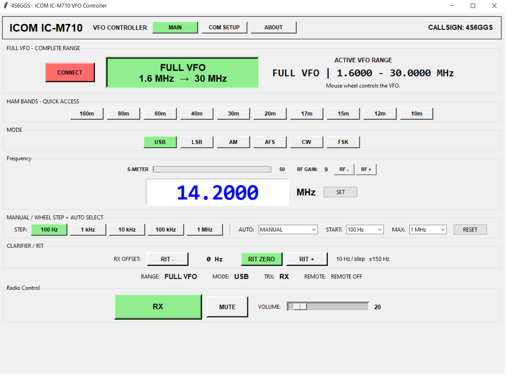

# 📻 ICOM IC-M710 VFO Controller

<h3 align="center">🎛️ Professional Windows VFO & Remote Control</h3>

<p align="center">
  A modern Windows control application for the
  <strong>ICOM IC-M710</strong> HF Marine Transceiver using the
  <strong>CI-V interface</strong>.
</p>

<p align="center">
  <a href="https://github.com/4s6ggs/icom-icm710-vfo/releases/latest">
    
  </a>
</p>

<p align="center">
  
  
  
  
  
</p>

---

# 📥 Download

## ⭐ Latest Release — v1.0.7

<p align="center">
  <a href="https://github.com/4s6ggs/icom-icm710-vfo/releases/latest">
    
  </a>
</p>

**Windows 10 / Windows 11**

The application is provided as a compiled Windows executable, so **Python is not required** to run the released `.exe`.

👉 **[Download the latest release from GitHub](https://github.com/4s6ggs/icom-icm710-vfo/releases/latest)**

> ⚠️ Make sure the v1.0.7 executable is uploaded to the GitHub Release assets before distributing the release.

---

# 📸 Screenshots

## 🆕 v1.0.7 — Main Interface

<p align="center">
  
</p>

## 📡 v1.0.7 — Communication / Control Interface

<p align="center">
  
</p>

---

# ✨ Features

<table>
<tr>
<td width="50%">

### 🎛️ VFO Control

* Full VFO operation
* 1.6000–30.0000 MHz
* Direct frequency entry
* Frequency readback
* Fast tuning
* Mouse-wheel tuning

</td>
<td width="50%">

### ⚡ Tuning System

* 100 Hz
* 1 kHz
* 10 kHz
* 100 kHz
* 1 MHz
* Manual tuning
* Automatic acceleration

</td>
</tr>

<tr>
<td>

### 📻 Amateur Bands

Quick selection for:

* 160 m
* 80 m
* 60 m
* 40 m
* 30 m
* 20 m
* 17 m
* 15 m
* 12 m
* 10 m

</td>
<td>

### 🎚️ Radio Control

* USB
* LSB
* AM
* AFS
* CW
* FSK
* RX / TX indication
* Remote status

</td>
</tr>

<tr>
<td>

### 📊 Monitoring

* Real-time S-Meter
* S0–S8 indication
* RX/TX status
* Frequency readback
* Communication monitoring
* Serial status

</td>
<td>

### ⚙️ Radio Settings

* RIT control
* RF Level control
* Volume control
* Speaker mute
* COM Port configuration
* Baud-rate selection

</td>
</tr>
</table>

---

# 🆕 What's New in v1.0.7

## 🔌 Communication Control

Version **1.0.7** introduces a dedicated communication-oriented interface for easier control and monitoring of the CI-V connection.

### Added

* 🔌 Dedicated Communication / COM page
* 🖥️ COM Port Monitor
* 🎚️ RIT control
* 📶 RF Level control
* 📡 Improved communication workflow
* 🔍 Better serial communication visibility
* ⚙️ Improved control organization

The communication interface makes it easier to diagnose and monitor the connection between the PC and IC-M710.

---

# 📈 Version History

## 🟢 v1.0.7 — Communication & Control

**Current Version**

### Highlights

* Dedicated Communication / COM interface
* COM Port Monitor
* RIT control
* RF Level control
* Improved CI-V communication workflow
* Improved user interface organization
* Enhanced radio control experience

---

## 🔵 v1.0.6 — Real-Time S-Meter

### Highlights

* 📊 Real-time S-Meter
* S0–S8 display
* Automatic S-Meter polling
* RX/TX-aware monitoring
* S-Meter reset after disconnect
* Improved monitoring interface

---

## 🟠 v1.0.5 — Core VFO Controller

### Highlights

* Full VFO frequency control
* Amateur-band quick selection
* Operating-mode control
* Mouse-wheel tuning
* Automatic tuning acceleration
* Frequency readback
* RX/TX status
* Remote status
* Volume control
* Speaker mute
* CI-V serial communication

---

# 🎛️ VFO CONTROL

## Full VFO

The controller provides a wide tuning range:

```text
1.6000 MHz ─────────────────────────────── 30.0000 MHz
```

### Frequency Range

| Parameter    |       Value |
| ------------ | ----------: |
| Minimum      |  1.6000 MHz |
| Maximum      | 30.0000 MHz |
| Default      | 14.2000 MHz |
| Default Mode |         USB |

---

# ⚡ Mouse-Wheel Tuning

The mouse wheel can be used as a fast VFO tuning control.

| Step | Resolution |
| ---: | ---------: |
|    1 |     100 Hz |
|    2 |      1 kHz |
|    3 |     10 kHz |
|    4 |    100 kHz |
|    5 |      1 MHz |

### Manual Mode

The selected tuning step remains fixed.

### Auto Acceleration

The controller can progressively increase the tuning step while the mouse wheel is being used.

This allows:

```text
Fine tuning
    ↓
100 Hz
    ↓
1 kHz
    ↓
10 kHz
    ↓
100 kHz
    ↓
1 MHz
    ↓
Fast frequency movement
```

Press **RESET** to return the wheel-control system to its initial state.

---

# 📻 Amateur Band Quick Access

| Band  |   Frequency Range |
| ----- | ----------------: |
| 160 m |   1.800–2.000 MHz |
| 80 m  |   3.500–4.000 MHz |
| 60 m  |   5.250–5.450 MHz |
| 40 m  |   7.000–7.300 MHz |
| 30 m  | 10.100–10.150 MHz |
| 20 m  | 14.000–14.350 MHz |
| 17 m  | 18.068–18.168 MHz |
| 15 m  | 21.000–21.450 MHz |
| 12 m  | 24.890–24.990 MHz |
| 10 m  | 28.000–29.700 MHz |

---

# 🎚️ Operating Modes

The controller provides quick access to the supported IC-M710 operating modes:

```text
USB    LSB    AM    AFS    CW    FSK
```

The selected operating mode is displayed directly in the controller interface.

---

# 📊 S-Meter

Introduced in **v1.0.6**, the S-Meter provides real-time signal monitoring.

### Display

```text
S0 ─ S1 ─ S2 ─ S3 ─ S4 ─ S5 ─ S6 ─ S7 ─ S8
```

The controller automatically polls the radio for signal information and updates the display.

When the connection is lost, the S-Meter is reset.

---

# 🔌 Communication

The application communicates with the IC-M710 through the radio's **CI-V interface**.

### Serial Configuration

Default settings:

| Setting       | Default |
| ------------- | ------- |
| COM Port      | COM1    |
| Baud Rate     | 4800    |
| Controller ID | 90      |
| Radio ID      | 01      |

Supported baud rates:

```text
1200
2400
4800
9600
19200
```

---

# 🖥️ COM Port Monitor

The v1.0.7 communication interface includes a COM monitoring function.

It can be used to observe serial communication and assist with troubleshooting.

Typical workflow:

```text
PC
 │
 │ USB / Serial Interface
 ▼
CI-V Interface
 │
 │ CI-V Communication
 ▼
ICOM IC-M710
```

---

# 🎚️ Radio Controls

The controller provides access to several important radio functions.

### RIT

Receiver Incremental Tuning control.

### RF Level

RF level adjustment from the controller interface.

### Volume

Radio audio volume control.

### Speaker

Speaker mute / unmute control.

### Remote

Displays the current remote-control state.

---

# 📡 RX / TX Status

The interface provides a clear transceiver state indicator:

```text
🟢 RX — Receive
🔴 TX — Transmit
```

This provides an immediate visual indication of the radio's operating state.

---

# ⚙️ Default Application Settings

| Setting       | Default            |
| ------------- | ------------------ |
| Frequency     | 14.2000 MHz        |
| Mode          | USB                |
| VFO Range     | FULL               |
| VFO Range     | 1.6000–30.0000 MHz |
| COM Port      | COM1               |
| Baud Rate     | 4800               |
| Controller ID | 90                 |
| Radio ID      | 01                 |
| Wheel Mode    | MANUAL             |
| Wheel Step    | 100 Hz             |
| Auto Maximum  | 1 MHz              |
| TRX State     | RX                 |
| Remote        | OFF                |

---

# 🔧 Hardware Interface

A USB-to-serial interface may be used as part of the PC connection.

For example, a **CP2102-based USB-UART adapter** may be suitable for the USB-to-UART portion of an interface, but the radio-side connection must be designed for the IC-M710 CI-V electrical interface.https://www.instructables.com/DIY-Universal-Radio-Clone-Cable-Using-CP2102-USB-I

> ⚠️ **Important:** Do not connect a generic UART directly to the radio without confirming the IC-M710 connector pinout, CI-V interface requirements, signal levels, and required interface circuitry.

The exact hardware interface is dependent on the transceiver configuration.

---

# 🆔 CI-V Identification

The controller uses separate identifiers for the controller and radio.

```text
Controller ID = 90
Radio ID      = 01
```

### Important

**REMT-ID** and **REMT-IF** are different settings/functions and should not be treated as the same parameter.

---

# 💻 System Requirements

### Operating System

* Windows 10
* Windows 11

### Hardware

* ICOM IC-M710
* Diy usb to com clone interface
  https://www.instructables.com/DIY-Universal-Radio-Clone-Cable-Using-CP2102-USB-I

### Software

For the compiled `.exe` release:

```text
Python is NOT required.
```

Simply run the Windows executable after connecting the appropriate interface.

---

# 🚀 Quick Start

### 1️⃣ Connect the Radio

Connect the IC-M710 to the computer using a suitable CI-V interface.

### 2️⃣ Start the Application

Run:

```text
ICOM_M710_VFO_Controller.exe
```

### 3️⃣ Select COM Port

Choose the serial COM port assigned to the CI-V interface.

### 4️⃣ Select Baud Rate

Use the baud rate configured for the radio/interface.

Default:

```text
4800
```

### 5️⃣ Connect

Press:

```text
CONNECT
```

### 6️⃣ Select Frequency

Enter a frequency such as:

```text
14.2000
```

and press:

```text
SET
```

### 7️⃣ Tune

Use:

* Mouse wheel
* Band buttons
* Direct frequency entry

---

# 🛠️ Troubleshooting

## ❌ Radio does not respond

Check:

* COM port
* Baud rate
* Radio ID
* CI-V wiring
* Interface hardware
* Radio CI-V configuration
* Serial connection

---

## ❌ COM port is not shown

Try:

1. Disconnect the USB interface.
2. Reconnect it.
3. Press **REFRESH**.
4. Check Windows Device Manager.
5. Confirm the USB-to-serial driver is installed.

---

## ❌ Frequency does not change

Check:

* Radio connection
* CI-V interface
* Radio ID
* Baud rate
* COM monitor output
* CI-V configuration

---

## ❌ S-Meter remains at S0

Check:

* Radio is connected.
* CI-V communication is working.
* The radio is receiving a signal.
* The COM interface is configured correctly.

---

# 📁 Project Structure

The recommended repository structure is:

```text
icom-icm710-vfo/
│
├── screenshot/
│   ├── screenshot-v1.0.7.png
│   └── screenshot-v1.0.7-2.png
│
├── ICOM_M710_VFO_Controller.exe
├── ICOM_M710_VFO_Controller_1.0.6.exe
│
└── README.md
```

---

# 🧩 Technology

The controller is designed as a Windows desktop application using:

```text
Python
Tkinter
PySerial
ICOM CI-V
```

The released Windows executable is packaged for direct use without requiring a Python installation.

---

# 👨‍💻 Developer

<p align="center">

### 4S6GGS

**ICOM IC-M710 VFO Controller**

Amateur Radio • Electronics • Software • Remote Control

</p>

---

# 📡 Project

<p align="center">
  <a href="https://github.com/4s6ggs/icom-icm710-vfo">
    
  </a>
</p>

---

# 📜 Version Timeline

```text
v1.0.5
  │
  ├── Core VFO Controller
  ├── Frequency Control
  ├── Band Selection
  ├── Mouse-Wheel Tuning
  └── CI-V Control
  │
  ▼
v1.0.6
  │
  ├── Real-Time S-Meter
  ├── S0–S8 Display
  └── Improved Monitoring
  │
  ▼
v1.0.7
  │
  ├── Communication / COM Page
  ├── COM Port Monitor
  ├── RIT Control
  ├── RF Level Control
  └── Communication Improvements
```
---

<p align="center">

<strong>📻 ICOM IC-M710 VFO Controller</strong>

<br>

<em>Control • Monitor • Tune • Communicate</em>

<br><br>

<strong>73 de 4S6GGS</strong>

</p>
