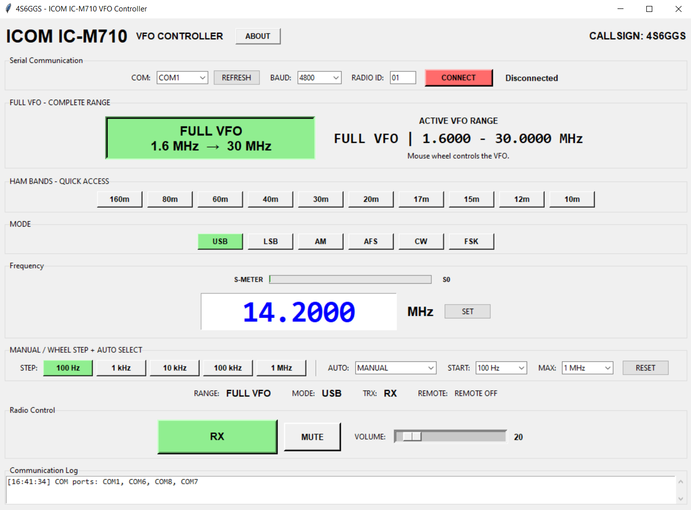

# ICOM IC-M710 VFO Controller

**Windows VFO and remote-control application for the ICOM IC-M710**

**Developer:** 4S6GGS
**Current Version:** `v1.0.7`
**Platform:** Windows 10 / Windows 11

---

## Overview

The **ICOM IC-M710 VFO Controller** is a Windows desktop application for controlling the ICOM IC-M710 through a compatible serial/CI-V remote-control interface.

The application provides a graphical interface for:

* Frequency control
* Full VFO operation
* Amateur-band quick selection
* Operating-mode selection
* Mouse-wheel VFO tuning
* Automatic tuning acceleration
* RX/TX status
* Remote status
* Volume control
* Speaker mute
* Real-time S-Meter
* RIT control
* RF Level control
* Serial communication configuration
* COM Port Monitor

The project is designed to provide a simple Windows interface for operating and monitoring an IC-M710 from a computer.

> **Important:** The radio, remote-control interface, connector wiring, and electrical interface must be correctly configured before using the application.

---

# Features

## VFO and Frequency Control

* Frequency entry and direct frequency setting
* Frequency readback
* Full VFO operation
* Amateur-band quick selection
* Mouse-wheel tuning
* Manual tuning-step selection
* Automatic tuning acceleration
* 100 Hz to 1 MHz tuning steps

### Full VFO Range

```text
1.6000 MHz – 30.0000 MHz
```

### Available Tuning Steps

```text
100 Hz
1 kHz
10 kHz
100 kHz
1 MHz
```

---

## Amateur Band Selection

Quick-access band ranges are provided for:

| Band  | Frequency Range   |
| ----- | ----------------- |
| 160 m | 1.800–2.000 MHz   |
| 80 m  | 3.500–4.000 MHz   |
| 60 m  | 5.250–5.450 MHz   |
| 40 m  | 7.000–7.300 MHz   |
| 30 m  | 10.100–10.150 MHz |
| 20 m  | 14.000–14.350 MHz |
| 17 m  | 18.068–18.168 MHz |
| 15 m  | 21.000–21.450 MHz |
| 12 m  | 24.890–24.990 MHz |
| 10 m  | 28.000–29.700 MHz |

The controller also supports the complete configured VFO range:

```text
1.6000 MHz → 30.0000 MHz
```

---

## Operating Modes

The controller provides:

```text
USB
LSB
AM
AFS
CW
FSK
```

---

# v1.0.7

Version **1.0.7** introduces a new Communication / COM Port page and additional Main-page controls.

## New in v1.0.7

### Separate Communication / COM Port Page

Communication settings are organized on a dedicated page.

The page provides:

* COM Port selection
* Baud Rate selection
* Controller ID
* Radio ID
* CONNECT / DISCONNECT
* COM Port Monitor

This separates communication configuration from normal radio operation.

---

### COM Port Monitor

The new COM Port Monitor allows the operator to monitor communication between the controller and the IC-M710.

It is useful for:

* Checking the serial connection
* Troubleshooting communication problems
* Checking transmitted commands
* Checking radio responses
* Testing a new interface or cable
* Confirming that the selected COM port is active

The COM Monitor is especially useful during initial interface testing.

---

### RIT Control

RIT Control has been added to the Main page.

**RIT — Receive Incremental Tuning** allows the receive frequency to be adjusted independently for fine receive-frequency correction.

---

### RF Level Control

RF Level Control has also been added to the Main page.

It provides additional control/monitoring of the radio RF/signal level during operation.

---

### Communication Improvements

Version 1.0.7 separates communication settings from the main radio-control interface, providing a cleaner communication configuration and monitoring workflow.

---

# v1.0.7 Screenshot

> **Screenshot status:** A dedicated `v1.0.7` screenshot is not currently present in the GitHub `main` branch.

The current repository contains:

```text
screenshot-v1.0.6.png
screenshot.png
```

There is currently no:

```text
screenshot-v1.0.7.png
```

Therefore, the README deliberately does **not** reuse an older screenshot and falsely identify it as v1.0.7.

When the v1.0.7 screenshot is added to the repository, use:

```markdown

```

---

# v1.0.6

Version **1.0.6** introduced the real-time S-Meter functionality.

## Real-Time S-Meter

The controller displays received signal level:

```text
S0 – S8
```

S-Meter polling:

* Runs while connected
* Runs during RX
* Stops during TX
* Resets to S0 after disconnect

The polling interval is approximately:

```text
300 ms
```

### v1.0.6 Screenshot



---

# v1.0.5

Version **1.0.5** established the original core VFO-control functionality, including:

* Frequency control
* Full VFO
* Amateur-band selection
* Operating-mode selection
* Frequency readback
* Mouse-wheel tuning
* Automatic acceleration
* RX/TX indication
* Remote status
* Volume control
* Speaker mute
* CI-V serial communication

### v1.0.5 Screenshot


---

# Radio Control

The application communicates with the IC-M710 using the ICOM CI-V serial interface.

Supported controller functions include:

* Frequency setting
* Frequency reading
* VFO tuning
* Operating-mode control
* RX/TX status
* Remote status
* Speaker mute
* Volume control
* Radio synchronization
* Serial communication monitoring
* Signal-strength monitoring
* RIT control
* RF Level control

---

# Serial Communication

## Default Settings

| Setting       | Default |
| ------------- | ------- |
| COM Port      | COM1    |
| Baud Rate     | 4800    |
| Controller ID | 90      |
| Radio ID      | 01      |

## Available Baud Rates

```text
1200
2400
4800
9600
19200
```

Select the correct COM port and baud rate for the connected CI-V interface.

---

# System Requirements

## Computer

* Windows 10
* Windows 11
* Available USB or serial connection
* Available Windows COM port

## Radio

* ICOM IC-M710
* Correctly configured remote-control interface
* Compatible serial/CI-V interface

## Software

The released application is a compiled Windows executable.

```text
Python installation: Not required
```

---

# Quick Start

## 1. Connect the Interface

Connect the compatible USB/serial interface between the computer and the IC-M710.

```text
Windows PC
    │
    │ USB
    ▼
USB / Serial Interface
    │
    │ Serial / CI-V
    ▼
ICOM IC-M710
```

---

## 2. Check the Windows COM Port

Open:

```text
Device Manager
    └── Ports (COM & LPT)
```

Identify the COM port used by the radio interface.

Example:

```text
CP210x USB to UART Bridge (COM4)
```

In this example:

```text
COM4
```

is the required COM port.

---

## 3. Configure the IC-M710

Before connecting the controller, verify the radio's remote-control settings.

The controller requires the correct:

```text
REMT-ID
REMT-IF
```

The `REMT-ID` is the Radio ID used by the controller.

---

## 4. Start the Application

Run:

```text
ICOM_M710_VFO_Controller_1.0.7.exe
```

---

## 5. Open Communication / COM Port

Configure:

```text
COM Port
Baud Rate
Controller ID
Radio ID
```

Default settings:

| Setting       | Default |
| ------------- | ------- |
| COM Port      | COM1    |
| Baud Rate     | 4800    |
| Controller ID | 90      |
| Radio ID      | 01      |

Supported baud rates:

```text
1200
2400
4800
9600
19200
```

---

## 6. Check COM Monitor

Use the COM Monitor to verify communication.

Check for:

* Transmitted commands
* Radio responses
* Communication activity

---

## 7. Connect

Press:

```text
CONNECT
```

After successful communication, return to the Main page.

---

## 8. Test the Radio

Check:

* Frequency
* Mode
* RX/TX status
* Remote status
* S-Meter
* RIT
* RF Level

---

# Default Settings

The application starts with the following defaults:

| Setting       | Default            |
| ------------- | ------------------ |
| Frequency     | 14.2000 MHz        |
| Mode          | USB                |
| VFO Range     | FULL               |
| VFO Range     | 1.6000–30.0000 MHz |
| COM Port      | COM1               |
| Baud Rate     | 4800               |
| Controller ID | 90                 |
| Radio ID      | 01                 |
| Wheel Mode    | MANUAL             |
| Wheel Step    | 100 Hz             |
| Auto Maximum  | 1 MHz              |
| TRX State     | RX                 |
| Remote        | OFF                |
| S-Meter       | S0                 |

---

# Hardware Interface

The controller requires a suitable interface between the Windows computer and the IC-M710.

A typical arrangement is:

```text
PC
 │
 │ USB
 ▼
USB / Serial Interface
 │
 ▼
Radio-Side Interface
 │
 ▼
IC-M710
```

> **Do not assume that a generic USB-to-UART adapter can be connected directly to the IC-M710.**

The required electrical interface, connector, pinout, signal levels, and wiring must be verified before connection.

---

# DIY CP2102 Interface

A CP2102 USB-to-UART module can be used as the USB/serial portion of a suitable interface.

A general CP2102 radio-cable reference is available here:

https://www.instructables.com/DIY-Universal-Radio-Clone-Cable-Using-CP2102/

This is a general radio interface reference and **not an IC-M710 wiring diagram**.

The IC-M710 connector and electrical interface must be independently verified.

> **Never connect an unverified CP2102 circuit directly to the IC-M710.**

---

# Radio ID

The IC-M710 Radio ID is configured in the radio's Set Mode.

General procedure:

```text
Radio OFF
   ↓
Hold FUNC + 1
   ↓
Power ON
   ↓
Enter Set Mode
   ↓
Use GROUP selector
   ↓
Find REMT-ID
```

For example:

```text
REMT-ID 01
```

Then configure:

```text
Radio ID = 01
```

in the controller.

The normal ID range is:

```text
01 – 99
```

The default value is normally:

```text
01
```

---

# REMT-ID and REMT-IF

These are two different settings.

## REMT-ID

Identifies the radio.

Example:

```text
REMT-ID = 01
```

The controller should then use:

```text
Radio ID = 01
```

## REMT-IF

Selects the remote-control interface.

It is **not** the Radio ID.

Always select the interface corresponding to the physical connection being used.

---

# Troubleshooting

## COM Port Not Available

Check:

* USB cable
* USB interface
* Windows Device Manager
* USB/serial driver
* COM port assignment
* Whether another application is using the COM port

Press **REFRESH** after connecting the interface.

---

## CONNECT Does Not Work

Check:

```text
COM Port
Baud Rate
Controller ID
Radio ID
REMT-ID
REMT-IF
Cable
Radio power
```

---

## COM Monitor Shows No Activity

Check:

* Correct COM port
* USB interface
* Cable connection
* Controller connection
* Whether another program has opened the COM port

---

## Commands Are Sent but Radio Does Not Respond

If the COM Monitor shows transmitted commands but no radio response, check:

* IC-M710 connector
* Radio-side interface
* TX/RX routing
* Ground/reference
* `REMT-IF`
* `REMT-ID`
* Baud rate
* Radio power

---

## Frequency Does Not Change

Check:

* Radio connection
* COM port
* Radio ID
* Controller ID
* Frequency range
* COM Monitor activity

---

## S-Meter Remains at S0

Check:

* Controller connection
* Radio RX state
* Serial communication
* COM Monitor
* Radio response

Remember that S-Meter polling stops during TX.

---

## RIT Does Not Respond

Check:

* Controller connection
* Radio communication
* COM Monitor
* Radio operating state

---

## RF Level Does Not Respond

Check:

* Controller connection
* Radio communication
* COM Monitor
* Radio operating state
* IC-M710 remote-control configuration
* Interface wiring

---

# Release History

## v1.0.7

**Communication and Main-page Control Update**

Added:

* Separate Communication / COM Port page
* COM Port Monitor
* RIT Control
* RF Level Control
* Improved communication configuration
* Improved communication monitoring
* Improved radio-control workflow

---

## v1.0.6

**Real-Time S-Meter Update**

Added:

* Real-time S-Meter
* S0–S8 signal indication
* Periodic signal-level polling
* RX/TX-aware S-Meter polling
* S0 reset on disconnect

---

## v1.0.5

**Core VFO Controller**

Established the original core controller functionality:

* Frequency control
* Full VFO operation
* Amateur-band selection
* Operating-mode control
* Mouse-wheel tuning
* Automatic acceleration
* Frequency readback
* RX/TX indication
* Remote status
* Volume control
* Speaker mute
* CI-V serial communication

---

# SHA-256 Checksums

## v1.0.7

Executable:

```text
ICOM_M710_VFO_Controller_1.0.7.exe
```

SHA-256:

```text
85e167451da74dc6a0ab8c68471e32b842706fe0b8516f771bec5275ed98b8b1
```

Verify with PowerShell:

```powershell
Get-FileHash .\ICOM_M710_VFO_Controller_1.0.7.exe -Algorithm SHA256
```

---

## v1.0.6

SHA-256:

```text
2956fceac0918cfa544eafabefab704a66dc9cc44892e3ac388f59fa62ac584d
```

---

## v1.0.5

SHA-256:

```text
60d02d21b5468971dfd9acc787fdb89184801a780a25e24daa7bb770353b08d7
```

---

# Download

## Latest Release — v1.0.7

Windows executable:

```text
ICOM_M710_VFO_Controller_1.0.7.exe
```

The v1.0.7 release is available from the GitHub Releases page.

---

# Project

**GitHub Repository**

https://github.com/4s6ggs/icom-icm710-vfo

**Latest Release**

https://github.com/4s6ggs/icom-icm710-vfo/releases/latest

---

# Disclaimer

This is an independent software project for controlling the ICOM IC-M710 through its serial/CI-V interface.

ICOM and IC-M710 are trademarks of their respective owner.

Use the software at your own risk and verify the correct CI-V configuration for your equipment before operating the radio.

The developer is not responsible for damage resulting from incorrect configuration, wiring, serial-interface settings, or operation of connected equipment.

---

# Developer

**4S6GGS**

**ICOM IC-M710 VFO Controller**

---

# License

See the repository for the applicable license terms.
